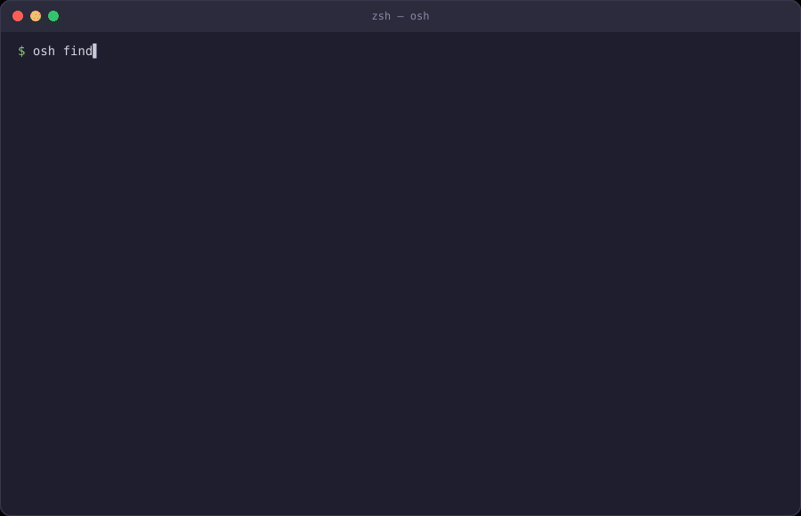
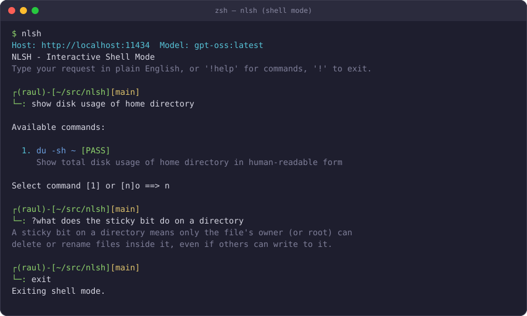
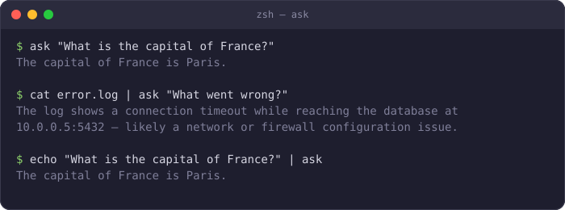

# NLSH

[](https://github.com/raulkivi/nlsh/actions/workflows/ci.yml) [](https://scorecard.dev/viewer/?uri=github.com/raulkivi/nlsh)  

Learn and use Linux through natural language — powered by local LLMs via Ollama or a local llama.cpp `llama-server`.

Describe what you want in plain English and get 3 executable command options, each with detailed explanations that break down every pipe, flag, and chained command so you understand what you're running.



## Features

- **Interactive shell mode** — Run `nlsh` with no arguments to enter a REPL; type queries continuously, use `!help` for commands, or `exit` / `!exit` to leave
- **Natural language to shell** — Describe what you want; get valid commands back
- **3 alternatives per query** — Each generated by its own focused LLM call: a couple of shell variants, then one-liners in awk, perl, python3, etc. depending on what's installed
- **Detailed explanations** — Each chained command (pipes, `&&`, `;`) explained on its own line
- **QA safety review** — Second-pass LLM review flags dangerous, incorrect, or imprecise commands
- **Command availability check** — Detects whether each suggested tool is installed before you run it
- **Language detection** — Auto-detects available scripting languages (bash, awk, perl, python3, ruby, node, etc.) and only suggests commands using what's installed
- **Cloud model support** — Use any Ollama cloud model by appending `:cloud` or `-cloud` to the model name (e.g. `llama3.2:cloud`); authenticates via `OLLAMA_API_KEY`
- **Per-invocation model override** — Use `-m <model>` to pick a different model without editing config; use `-m -` to select interactively from available Ollama models
- **Thinking model support** — Handles models that use a separate `thinking` field (e.g., gpt-oss, deepseek-r1) with automatic response extraction and reformatting
- **Clipboard support** — Copy any command to clipboard instead of executing
- **Retry on failure** — If a command fails or misses the question, refine and retry interactively
- **Daily log files** — All queries, responses, verdicts, and user actions logged to `~/.local/state/nlsh/YYYYMMDD.log`
- **XDG-compliant paths** — Config in `~/.config/nlsh/`, state in `~/.local/state/nlsh/`, app in `~/.local/nlsh/`
- **`ask` companion** — Pipe any text through `ask` for general-purpose LLM Q&A

## Requirements

- Python 3.11+
- [Ollama](https://ollama.ai) installed and running locally, or a local [llama.cpp](https://github.com/ggml-org/llama.cpp) `llama-server`

## Quick Start

```bash
# Install
./install.sh

# Use
nlsh what is my public IP address
nlsh find all python files modified in the last 24 hours
nlsh show failed ssh login attempts grouped by IP
```

## Installation

```bash
./install.sh
```

The installer will:
1. Copy app files to `~/.local/nlsh/`
2. Create symlinks in `~/.local/bin/` (`nlsh`, `ask`, `computer`)
3. Prompt for Python environment (pyenv, venv, or system)
4. Install pip dependencies
5. Let you choose a backend — Ollama (lists installed models) or llama.cpp `llama-server` (lists models from a running server, or lets you type the model name)
6. Save configuration to `~/.config/nlsh/config.json`

After installation, ensure `~/.local/bin` is in your PATH:

```bash
echo 'export PATH="$HOME/.local/bin:$PATH"' >> ~/.zshrc  # or ~/.bashrc
source ~/.zshrc
```

### Manual Install

```bash
pip3 install -r requirements.txt
chmod +x nlsh.py ask.py
mkdir -p ~/.local/bin
ln -s $(pwd)/nlsh.py ~/.local/bin/nlsh
ln -s $(pwd)/ask.py ~/.local/bin/ask
nlsh --init
```

## Usage

```bash
nlsh                         # Enter interactive shell mode (REPL)
nlsh <natural language query>
nlsh -a <query>              # Always prompt before executing
nlsh -m <model> <query>      # Use a specific model (overrides config)
nlsh -m - <query>            # Pick model interactively from Ollama
nlsh --config PATH <query>   # Use alternate config file
nlsh --init                  # Interactive configuration
nlsh --version               # Show version
```

### Shell Mode (REPL)

Running `nlsh` without arguments enters an interactive session where you can submit queries one after another without re-invoking the command. The prompt mimics a zsh-style two-line prompt, showing your user, current directory, and git branch (when inside a repo).



```
$ nlsh
Host: http://localhost:11434  Model: gpt-oss:latest
NLSH - Interactive Shell Mode
Type your request in plain English, or '!help' for commands, '!' to exit.

┌(raul)-[~/src/nlsh][main]
└─: show disk usage of home directory
...
┌(raul)-[~/src/nlsh][main]
└─: !help
Available commands:
  !exit                Exit shell mode
  !quit                Exit shell mode
  !help                Show this help message
  !version             Show nlsh version
  !history             Show recent queries from today's session log
  !                    Exit shell mode (shorthand)

Or type any request in plain English.
┌(raul)-[~/src/nlsh][main]
└─: exit
Exiting shell mode.
```

| Input | Action |
|-------|--------|
| Any natural language | Translated to shell commands as normal |
| `?<question>` | Ask the LLM directly (like the `ask` companion), bypassing shell-command generation |
| `exit`, `quit`, `bye`, `done`, … | Exit shell mode |
| `!exit` / `!quit` / `!` | Exit shell mode |
| `!help` | List available `!` commands |
| `!version` | Show nlsh version |
| `!history` | Show recent queries from today's session log |
| Ctrl-C / Ctrl-D | Exit shell mode |

### Example Session

```zsh
$ nlsh find all log files modified in the last 7 days and show their sizes
Host: http://localhost:11434  Model: gpt-oss:latest
Generating command options...
Checking command availability...
Running safety review...

Available commands:

  1. find /var/log -name '*.log' -mtime -7 -exec du -sh {} + [PASS]
     Find all .log files modified within 7 days and display their sizes
     find /var/log -name '*.log' -mtime -7: search for .log files modified in the last 7 days
     -exec du -sh {} +: calculate and display human-readable size for each match

  2. find /var/log -name '*.log' -mtime -7 | xargs du -sh [PASS]
     Same goal using pipe to xargs instead of -exec
     find /var/log -name '*.log' -mtime -7: locate recently modified .log files
     | xargs du -sh: pass found files to du for size display

  3. perl -e 'use File::Find; find(sub { print `du -sh $_` if /\.log$/ && -M $_ < 7 }, "/var/log")' [PASS]
     Perl one-liner using File::Find to traverse /var/log
     find(sub { ... }, "/var/log"): recursively walk the directory
     /\.log$/ && -M $_ < 7: match .log files modified within 7 days
     print `du -sh $_`: shell out to du for each match

Select command [1/2/3] [c]opy or [n]o ==>
```

### Selection Options

| Key | Action |
|-----|--------|
| **1–3** | Execute that command |
| **c** | Copy a command to clipboard |
| **n** / Enter | Cancel |

### QA Verdicts

Each command is tagged by the safety review:

| Verdict | Meaning |
|---------|---------|
| **PASS** (green) | Correct, safe, matches intent |
| **WARN** (yellow) | Works but has a concern — confirmation required |
| **MISS** (magenta) | Safe but doesn't precisely answer the question |
| **FAIL** (red) | Dangerous, incorrect, or insecure — execution blocked |

### Ask

Pipe text to `ask` for general-purpose Q&A:



```bash
ask "What is the capital of France?"
ask what is the capital of France?
echo "What is the capital of France?" | ask
cat error.log | ask "What went wrong?"
```

## Configuration

### Interactive Setup

```bash
nlsh --init
```

### Config File

`~/.config/nlsh/config.json`:

```json
{
  "api": "ollama",
  "model": "gpt-oss:latest",
  "temperature": 0.3,
  "max_tokens": 2400,
  "safety": true,
  "qa_review": true,
  "suggested_command_color": "blue",
  "python_venv": null,
  "ollama_endpoint": "http://localhost:11434",
  "ollama_cloud_endpoint": "https://ollama.com",
  "llama_cpp_endpoint": "http://localhost:38080",
  "logging_enabled": true,
  "log_retention_days": 30
}
```

| Option | Description | Default |
|--------|-------------|---------|
| `api` | Backend to use: `"ollama"` or `"llama_cpp"` | `ollama` |
| `model` | Model name (Ollama model name, or the model llama-server has loaded) | `gpt-oss:latest` |
| `temperature` | Randomness (0.0–2.0) | `0.3` |
| `max_tokens` | Max response tokens (increase for thinking models) | `2400` |
| `safety` | Stored/shown by `--init` and the usage screen; not currently wired to any prompt-before-execute logic (that's controlled by `-a`/`--ask` and WARN verdicts) | `true` |
| `qa_review` | Enable second-pass safety review | `true` |
| `suggested_command_color` | Terminal color for displayed commands | `blue` |
| `python_venv` | `null`, `"pyenv:name"`, or `"venv:/path"` | `null` |
| `ollama_endpoint` | Local Ollama API URL | `http://localhost:11434` |
| `ollama_cloud_endpoint` | Ollama cloud API URL | `https://ollama.com` |
| `llama_cpp_endpoint` | Local llama.cpp `llama-server` URL (used when `api` is `"llama_cpp"`) | `http://localhost:38080` |
| `logging_enabled` | Enable daily log files | `true` |
| `log_retention_days` | Auto-delete logs older than N days | `30` |

### llama.cpp (`llama-server`)

Both `nlsh` and `ask` can talk to a local [llama.cpp](https://github.com/ggml-org/llama.cpp) `llama-server` instead of Ollama, via its OpenAI-compatible `/v1/chat/completions` endpoint. Start the server (e.g. `llama-server -m model.gguf --port 38080`), then set:

```json
{
  "api": "llama_cpp",
  "model": "model-name-as-loaded-by-llama-server",
  "llama_cpp_endpoint": "http://localhost:38080"
}
```

Both tools read the same `~/.config/nlsh/config.json`, so this switches the backend for both at once. `./install.sh` and `nlsh --init` offer this as a backend choice, and `nlsh -m -` lists models exposed by the running `llama-server`. Cloud models (`:cloud`/`-cloud` suffix) are an Ollama-only feature and don't apply to this backend.

### Custom Config Path

```bash
nlsh --config /path/to/config.json what is my username
```

### Python Virtual Environment

```json
{"python_venv": "pyenv:312"}
{"python_venv": "venv:/home/user/.venvs/myenv"}
{"python_venv": null}
```

### Cloud Models

Ollama cloud models can be used by appending `:cloud` or `-cloud` to any model name:

```bash
nlsh -m llama3.2:cloud list files modified today
nlsh -m llama3.2-cloud what is my public IP
```

Or set a cloud model as your default in `~/.config/nlsh/config.json`:

```json
{"model": "llama3.2:cloud"}
```

**Setup (one-time):**

1. Create a free account at [https://ollama.com](https://ollama.com)
2. Generate an API key in your account settings
3. Export the key in your shell profile (`~/.bashrc` or `~/.zshrc`):

```bash
export OLLAMA_API_KEY=<your-key>
```

If `OLLAMA_API_KEY` is not set when a cloud model is invoked, nlsh will exit with a clear error and setup instructions.

## Examples

```bash
# System
nlsh what is my current working directory
nlsh show me system uptime
nlsh check if port 8080 is open

# Files
nlsh find all files larger than 100MB
nlsh compress the logs directory
nlsh count lines in all python files recursively

# Network
nlsh what is my public IP address
nlsh list all IP addresses of NICs that start with wlp
nlsh show all open network connections

# Processes
nlsh is nginx running
nlsh show all python processes
nlsh kill process on port 3000

# Data processing
nlsh extract columns 1 and 3 from data.csv
nlsh count unique values in column 2 of users.csv sorted by frequency

# Log analysis
nlsh show failed ssh login attempts from auth.log grouped by IP
nlsh extract unique IPs from nginx access.log that returned 404
nlsh find all sudo commands in auth.log grouped by user
```

## Architecture

### Processing Pipeline

```
User query
  → For each approach (2 shell variants, then one per detected scripting
    language) issue a focused LLM call requesting exactly one command
    (XML-tagged: <c1>...<e1>...)
  → Collect unique commands, skipping duplicates/parse failures, until
    3 have been gathered
  → Check command availability (shutil.which + shell builtins)
  → QA safety review (single LLM call evaluating all collected commands)
  → Display options with verdicts
  → User selects → Execute
```

### Key Components

| File | Purpose |
|------|---------|
| `nlsh.py` | Main application — prompts, LLM interaction, parsing, execution |
| `ask.py` | Pipe-based general Q&A companion |
| `install.sh` | Interactive installer with venv and model selection |
| `tests/` | pytest suite covering config, parsing, safety guards, and interactive flows |
| `evals/` | Opt-in script comparing QA safety-verdict accuracy across local Ollama models |

### Thinking Model Handling

Models like gpt-oss place output in a `thinking` field instead of `content`. When `content` comes back empty, nlsh:
1. Searches the `thinking` text for `<cN>`/`<eN>` tagged commands and explanations
2. If tags are found, rebuilds them into a normal tagged response
3. If no tags are found, falls back to returning the raw thinking text as-is
4. Filters placeholder/garbage commands (literal "command", "echo 'Could not extract commands'")

This is a single best-effort extraction pass — there's no reformat retry or token-budget scaling. If a thinking model's output doesn't contain recognizable tags, that approach is simply skipped, and `collect_unique_options` moves on (it targets 3 options but doesn't strictly require them).

### Language Detection

On startup, nlsh probes for available scripting languages:

```
bash, awk, sed, perl, python3, ruby, node, php, lua, Rscript
```

The detected list is injected into the system prompt so the model only suggests commands using tools actually installed on the system.

## Logging

Daily log files in `~/.local/state/nlsh/YYYYMMDD.log`:

```
2026-02-21 10:30:45 | INFO | AVAILABLE_LANGUAGES: bash, awk, sed, perl, python3, node
2026-02-21 10:30:46 | INFO | SINGLE_OPTION_REQUEST: approach=shell_1
2026-02-21 10:30:47 | INFO | SINGLE_OPTION_RESPONSE: approach=shell_1 | <c1>find / -size +100M -exec ls -lh {} \; </c1><e1>...</e1>
2026-02-21 10:30:47 | INFO | OPTION_ACCEPTED: approach=shell_1 | cmd=find / -size +100M -exec ls -lh {} \;
2026-02-21 10:30:47 | INFO |   ... (repeated per approach until 3 unique options are collected)
2026-02-21 10:30:48 | INFO | COMMAND_CHECK: find | EXISTS: True
2026-02-21 10:30:49 | INFO | QA_REVIEW: Sending 3 commands for safety review
2026-02-21 10:30:50 | INFO | QA_RESPONSE: 1|PASS| | 2|PASS| | 3|WARN|Requires sudo
2026-02-21 10:30:52 | INFO | USER_SELECTED: Option 1 | COMMAND: find / -size +100M -exec ls -lh {} \;
2026-02-21 10:30:52 | INFO | ACTION: EXECUTE
```

Old logs auto-deleted after `log_retention_days` (default: 30).

## Uninstall

```bash
rm -rf ~/.local/nlsh ~/.config/nlsh ~/.local/state/nlsh
rm -f ~/.local/bin/nlsh ~/.local/bin/ask ~/.local/bin/computer
pip3 uninstall ollama termcolor pyperclip
```

## Ollama Setup

```bash
curl -fsSL https://ollama.ai/install.sh | sh
ollama pull llama3
```

## License

[MIT](LICENSE) © 2026 [Raul Kivi](https://www.linkedin.com/in/raulkivi/)
